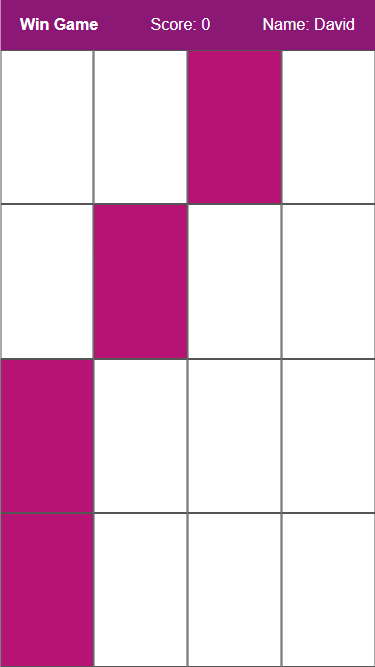

# GITHUB INDICATORS

  # Game-Score-SvelteJS

Hello, welcome to this lesson. Today I create with html, css and Svelte.js file for Game-Score-SvelteJS. I use here html, css and Svelte.js tags. 

## ## RULES OF USE

> **STEP-1:** `https://github.com/cavidsuleyman/Dictionary-App-SvelteJS.git`  
> **STEP-2:**  enter the `Game-Score-SvelteJS` folder that appears  
> **STEP-3:**  open the folder you are in in a text editor  
> **STEP-4:**  run the  all the files in the main folder "npm run dev"  
> **STEP-5:**  to download the project as `.zip`  [here](https://github.com/cavidsuleyman/Dictionary-App-SvelteJS/archive/refs/heads/master.zip) click  

## Technology

This project was developed using the following technologies

| No | Technique | Purpose |
| - | ---------- | --------------------- |
| 1 | HTML | Building a project skeleton |
| 2 | CSS |  Make-up of the established skeleton |
| 3 | GIT |  Project version control management |
| 4 | SvelteJS | Dynamic operations |
| 5 | VSCode | Text editor used in the project |

## SAMPLE SCREEN APPEARANCE

 
